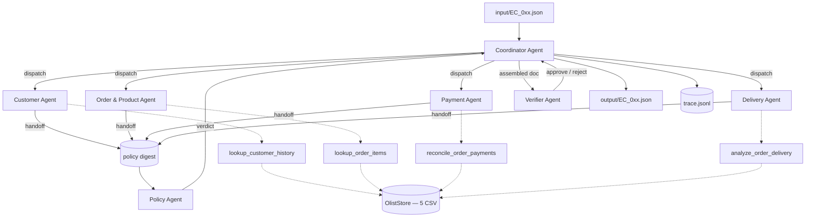

# Architecture — Multi-Agent E-commerce Dispute Resolution

Hệ thống điều tra 50 khiếu nại trên dữ liệu Olist bằng 7 agent. Mỗi agent sở
hữu một domain dữ liệu, gọi tool riêng của mình, rồi handoff kết quả cho agent
kế tiếp. Coordinator điều phối và Verifier chặn trước khi ghi file.

## 1. Sơ đồ agent

## 2. Vai trò và quyền truy cập

Quyền truy cập được **cưỡng chế tại runtime** qua ma trận `AGENT_TOOL_ACCESS`
trong `src/agent_tools.py`. Agent gọi tool ngoài quyền sẽ nhận `ToolAccessError`
— Delivery Agent không thể đọc được payment row kể cả khi prompt bị chệch.

| Agent | Tool được phép | Bảng dữ liệu chạm tới | Output handoff |
| --- | --- | --- | --- |
| Coordinator | *(không)* | *(không)* | dispatch, digest, doc cuối |
| Customer | `lookup_customer_history` | customers, orders | `customer_unique_id`, `related_order_ids`, `repeat_customer` |
| Order & Product | `lookup_order_items` | orders, order_items, products | `item_ids`, `seller_ids`, `product_ids`, `category_names`, các count |
| Payment | `reconcile_order_payments` | order_items, order_payments | `payment_total_brl`, `expected_total_brl`, `difference_brl`, `reconciled` |
| Delivery | `analyze_order_delivery` | orders, order_items | `delivery_variance_hours`, `seller_handoff_analysis`, `late_handoff_seller_ids` |
| Policy | *(không — chỉ nhận digest)* | *(không)* | `primary_issue`, `secondary_issues`, `responsible_party_type` |
| Verifier | *(không — chỉ nhận doc)* | *(không)* | `approved`, `issues` |

`olist_geolocation_dataset.csv` (62 MB) và `olist_order_reviews_dataset.csv`
không được load: không trường nào trong output schema phụ thuộc vào chúng.

## 3. Luồng handoff của một case

1. **Coordinator** đọc `claimed_order_id`, phát `dispatch` cho 4 domain agent.
2. Mỗi **domain agent** chạy 2 lượt LLM: lượt 1 chọn tool (`tool_choice=required`),
   lượt 2 đọc kết quả tool và phát ra JSON handoff. Nếu model không chịu gọi
   tool, coordinator gọi thay và ghi `tool_forced=true` — điều tra không được
   phép đứng vì model nhỏ bỏ lượt.
3. **Coordinator** gộp 4 handoff thành `policy digest` — chỉ gồm các trường mà
   bảng policy dùng tới, không có nhiễu.
4. **Policy Agent** phân loại theo EC_POLICY_V2 và trả `primary_issue`,
   `secondary_issues`, `responsible_party_type`.
5. **Coordinator** đối chiếu verdict với bảng policy. Sai → gửi lại kèm lý do
   (1 lần). Vẫn sai → override deterministic, ghi `policy_override` vào trace.
6. **Coordinator** lắp document từ **kết quả tool**, chạy schema check.
7. **Verifier Agent** duyệt document + kết quả schema check.
8. Ghi `output/EC_0xx.json` và `case_end` vào trace.

## 4. Hai nguyên tắc thiết kế

### Số liệu đến từ tool, không đến từ model

Đề giới hạn model ≤10B. Model cỡ đó không trừ nổi hai mốc timestamp ra số giờ,
cũng không cộng nổi BRL tới hàng xu. Nên toàn bộ số học nằm trong
`src/analysis.py`, và **coordinator lắp document từ giá trị tool trả về**, không
lấy từ câu chữ model viết ra. Model quyết định *gọi tool nào* và *kết quả đó
nghĩa là gì* — đó mới là phần nó làm tốt.

Handoff JSON do model viết vẫn được ghi đầy đủ vào `trace.jsonl` để đối chiếu,
nhưng nó không phải nguồn của con số trong bài nộp.

### Bất đồng được ghi lại, không bị giấu

Policy Agent là điểm ra quyết định thật. Khi nó chọn sai, hệ thống **không im
lặng sửa**: `policy_rejected` ghi lý do, retry 1 lần kèm feedback, rồi
`policy_override` nếu vẫn sai. `policy_agreement_rate` trong `metadata.json` là
tỷ lệ agent tự chọn đúng — con số này phản ánh trung thực năng lực model, và
việc che nó đi sẽ làm trace mất giá trị làm bằng chứng.

Riêng **thứ tự** `secondary_issues` được coordinator sắp lại theo thứ tự chuẩn
thay vì bị tính là bất đồng: đó là ràng buộc format của schema, không phải một
phán đoán nghiệp vụ.

## 5. Điều chỉnh sau smoke test

Lượt smoke test đầu tiên đạt agreement 0/2. Trace cho thấy model lấy
`primary_issue` gần đúng nhưng bịa `secondary_issues` — gán `multi_seller_order`
cho đơn chỉ có 1 seller vì nó không thực sự so `seller_count >= 2`.

Sửa: digest chuyển từ **count thô** sang **boolean đã tính sẵn**
(`multi_seller_order: false`), kèm một ví dụ input/output trong prompt. Nhiệm
vụ của model chuyển từ "tự suy ra ngưỡng" thành "chọn đúng các field đang true"
— việc mà 8B làm ổn định. Agreement lên 6/6 ngay lượt kế tiếp.

## 5b. Kết quả lượt chạy chính thức

Run `20260805T152449`, 50/50 case, 364.5s, 527 lượt gọi LLM (224.782 token vào
/ 23.228 token ra).

| Chỉ số | Giá trị |
| --- | --- |
| Policy agreement | **45/50 (90%)** — agent tự chọn đúng, không cần override |
| Policy override | 5 case (`EC_018`, `EC_025`, `EC_036`, `EC_041`, `EC_048`) |
| Verifier approved | 50/50 |
| Schema failures | 0 |
| Forced tool calls | 0 — model chủ động gọi tool đúng ở cả 200 lượt |
| Diff vs `run_baseline.py` | **0/50 case khác nhau** |

Ba kiểu sai model hay mắc, đọc từ `policy_rejected` trong trace:

1. **Bỏ sót secondary issue** (15 lần) — quên `split_payment` hoặc
   `repeat_customer` dù field trong digest đang `true`.
2. **Nhảy cóc bảng ưu tiên** (9 lần) — chọn `valid_split_payment` cho đơn chỉ có
   1 payment row, hoặc `late_delivery_logistics` khi đã có seller bàn giao muộn.
3. **Thêm secondary issue không có thật** (2 lần) — `multi_seller_order` trên
   đơn 1 seller.

Cả 32 lần reject đều được retry kèm lý do; 27 lần model tự sửa đúng ở lượt 2,
5 lần còn lại phải override. Vì document được lắp từ kết quả tool và
`primary_issue` được đối chiếu với bảng policy, 5 case override vẫn cho ra
output đúng — đó là lý do diff với baseline bằng 0.

## 6. Cấu hình model

| Hạng mục | Giá trị |
| --- | --- |
| Provider | OpenRouter |
| Model | `meta-llama/llama-3.1-8b-instruct` — **8B**, dưới trần 10B |
| Áp dụng cho | cả 7 agent (`AGENT_MODELS` trong `src/llm_config.py`) |
| Decoding | `temperature=0.0`, `top_p=1.0`, `seed=20260805` |
| Framework | orchestrator tự viết, chỉ dùng standard library |

Tên model khai báo trong `src/llm_config.py` và mirror sang `metadata.json`.
`.env` chỉ chứa API key và đã được `.gitignore`.

`assert_within_param_cap(10)` chạy lúc khởi động, chặn ngay nếu ai đó đổi sang
model quá 10B.

## 7. File liên quan

| File | Vai trò |
| --- | --- |
| `src/data_store.py` | Load và index 5 CSV |
| `src/analysis.py` | 5 analyzer thuần — nơi duy nhất có số học |
| `src/policy.py` | EC_POLICY_V2 |
| `src/schema.py` | Lắp output + verifier deterministic |
| `src/agent_tools.py` | Tool spec + ma trận quyền truy cập |
| `src/agents.py` | Prompt và vòng chạy từng agent |
| `src/orchestrator.py` | Coordinator, trace writer, override logic |
| `src/llm_client.py` | OpenRouter client (urllib, retry, token accounting) |
| `src/llm_config.py` | Registry model — tên model nằm trong source |
| `run_baseline.py` | Bản deterministic, không LLM — dùng làm ground truth |
| `run_agents.py` | Chạy multi-agent, sinh trace + metadata |
| `scripts/compare_outputs.py` | Diff agent run vs baseline |
